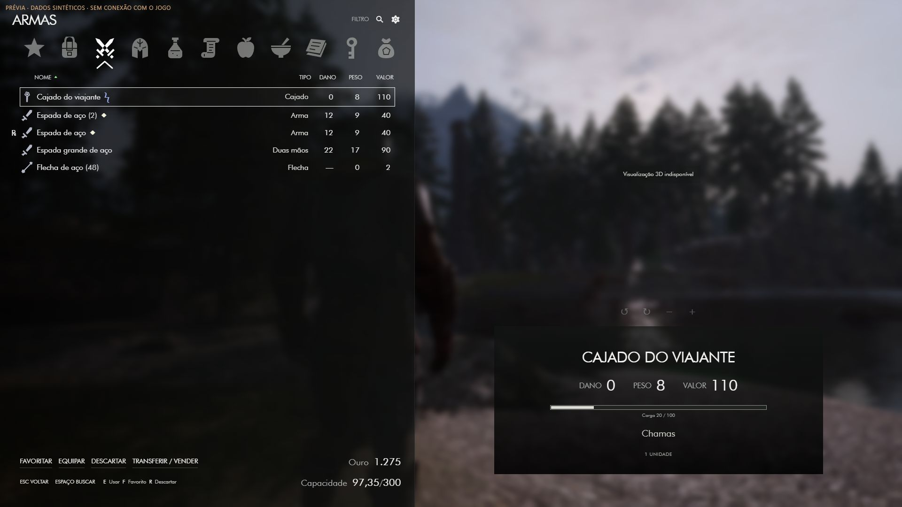

# Interface conforme as referências — 03/10/2026

A apresentação anterior em três colunas foi substituída pela composição solicitada nas duas imagens: painel de inventário à esquerda (46% da tela), área livre para o modelo à direita e ficha inferior com nome, stats, carga e efeitos. O fundo de jogo permanece visível; apenas a lista e a ficha recebem superfícies escuras translúcidas. A prévia usa a captura já disponível no Core, com desfoque CSS; a instalação no jogo não recebe esse fundo como substituto do mundo real.

## Navegação e leitura

- Ícones locais SVG para Favoritos, Todos, Armas, Vestuário, Poções, Pergaminhos, Comida, Ingredientes, Livros, Chaves e Diversos. A categoria ativa tem ícone branco e chevron; nomes ficam disponíveis por tooltip e acessibilidade.
- A categoria normalizada do servidor permanece uma das oito originais. Favoritos é um filtro de estado; Pergaminhos usa `equip.kind === 'scroll'`. Não há alteração de catálogo ou identidade de item.
- Quantidades aparecem ao lado do nome. A lista mostra tipo, peso e valor; Armas acrescenta dano e Vestuário acrescenta Armor. Seleção recebe contorno e texto #69CF99 em negrito; equipado também recebe texto verde em negrito; favoritos, encantamentos, missão, roubo e mão equipada têm marcadores próprios.
- Clique no título de uma coluna para ordenar; repita para inverter. Busca por lupa, Espaço ou `/`. Engrenagem oferece filtros adicionais e ordenação por quantidade.
- Ações do item ficam no rodapé esquerdo. E equipa, F alterna favorito, R abre confirmação Sim/Não de destruição, T chama o adaptador futuro de recarga. ESC fecha primeiro diálogo, busca ou opções; o retorno ao radial continua a cargo do Core. Não foram inventadas funções de controle ou barras de recursos sem vínculo ao host.
- A área 3D reaproveita o controller existente e comunica indisponibilidade enquanto faltar o bridge nativo. Nome, stats e efeitos continuam disponíveis.

## Fronteira com o Core

O módulo mantém a mesma Main View, registro, rota e transporte. Estilos de tela inteira são restritos a `.shell.is-inventory-workspace`; a aparência externa do shell é restaurada no unmount. O botão Voltar delega ao handler existente do Core. Não foram editados checkouts de referência nem o backend transacional.

## Validação desta revisão

Na prévia local: abrir pelo radial, alternar categorias e favoritos, ordenar por dano, buscar, escolher mão direita e dividir uma pilha, consumir uma poção (3 → 2), mostrar pergaminhos, ler livro, fechar e reabrir o módulo. O retorno ao radial removeu a classe de estilo do inventário. Console sem erros nesta execução.

Layout medido em 1920×1080, 2560×1440 e 3440×1440. Nas duas resoluções maiores, sem overflow horizontal da página ou do painel esquerdo. A captura final é `screenshots/inventory-reference-1080.jpg`. Isso valida a interface no browser, não renderer/input no Skyrim.

## Novo menu compacto e arte 0.2.0

Subrota /inventory/favorites compartilha fonte de dados e componentes; painel de até 480px à esquerda, seleção pelo hover, badges 1–9 e equipamento por mouse/E. SVGs originais de contorno irregular substituem ícones sólidos. Wheel acumula velocidade e desacelera. A aparência nova ainda não foi conferida visualmente: abertura da prévia foi bloqueada pela política do navegador nesta rodada. Capturas anteriores representam a versão anterior. Ver FAVORITES_HOTKEYS.md.

## Escala do conteúdo — 04/10/2026

Conteúdo reduzido em 20% por `--inv-content-scale: .8`: cabeçalho, categorias, busca, opções, lista/linhas, rodapé, controles de preview, conteúdo da ficha, favoritos e diálogos. Os painéis e a divisão 46%/54% mantêm suas dimensões; a área de preview nativo continua usando seu retângulo físico. A escala é aplicada uma única vez por grupo via zoom de layout, inclusive nos breakpoints existentes, preservando a correspondência entre hit areas e conteúdo e a rolagem. Feedback de erro/pendência tem tipografia e padding reduzidos sem deslocar seu ancoramento. Cores, ícones desenhados e estados em negrito permanecem.

CSS conferido pelo parser esbuild sem avisos. Esta alteração não foi conferida visualmente no navegador; o histórico de bloqueio da prévia permanece registrado em VALIDATION.md.
